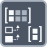

<!-- Generated by tools/export_studio_help.py; edit the reviewed source metadata, then regenerate. -->
# Get Matrix Subset

[Array functions](../overview.md) · [All functions](../../index.md)

Extracts a rectangular subset from a matrix.

## Product execution profiles

The shared index declares native examples for this object; see [the examples below](get_subset.md#examples) and [document profiles and evidence boundaries](../../../reference/studio-draft-examples.md). Older binding/help statements retained below can lag those product profiles. They do not establish or deny the separately measured native profiles. An example declaration alone is not an execution result or admission of every overload.

Résumé français de l’aide Studio

**Obtenir une sous-matrice**

Texte historique de l’aide conservé ci-dessous. Des exemples natifs distincts sont déclarés pour cet objet ; consultez les profils et preuves datés, sans déduire une compatibilité universelle de ce texte.

Extrait une sous-matrice rectangulaire d'une matrice.

## Studio authoring profile

Contract status: **partial**. The connector below describes Studio authoring; execution availability is stated separately.

## IN — inputs

| Displayed terminal / internal ID | Accepted / resolved type | Studio connection | Unwired input default | Meaning |
| --- | --- | --- | --- | --- |
| matrix `matrix` | `array<T:numeric,rank=2>` | Required | Not specified | — |
| first row `row` | `T:numeric` | Recommended (help); Optional (binding) | Not specified | — |
| first column `column` | `T:numeric` | Recommended (help); Optional (binding) | Not specified | — |
| last row `rows` | `T:numeric` | Recommended (help); Optional (binding) | Not specified | — |
| last column `columns` | `T:numeric` | Recommended (help); Optional (binding) | Not specified | — |

A default is shown only for an input with an explicitly documented value. Preview/default *types* do not imply unwired operand values. If helper and binding flags differ, both are labelled.

## OUT — outputs

| Displayed terminal / internal ID | Accepted / resolved type | Studio connection | Unwired input default | Meaning |
| --- | --- | --- | --- | --- |
| submatrix `result` | `array<T:numeric,rank=2>` | Recommended (help); Required (binding) | — | — |

A default is shown only for an input with an explicitly documented value. Preview/default *types* do not imply unwired operand values. If helper and binding flags differ, both are labelled.

## Types and Compatibility

The notes below retain the reviewed help's original NI and Studio scopes. An NI overload is not a claim of Studio runtime support; the authoring profile and execution limits remain separate.

Retained binding and help statements

These are source declarations, not the current measured product-execution assessment. Compare historical limitations with the separately dated native profiles above.

Numeric 2D input/output. Four optional scalar real numeric bounds (first/last row, first/last column) convert to I32. End bounds are inclusive indices, not lengths. Unwired bounds select the full extent.

Notes de types et de compatibilité de l’aide Studio

Les mentions NI et Studio gardent leur portée d’origine. Une variante NI ne constitue pas une déclaration de prise en charge par le runtime Studio ; consultez les profils et limites d’exécution de cette fiche.

Entrée/sortie numérique 2D. Quatre bornes optionnelles réelles (première/dernière ligne, première/dernière colonne), converties en I32. Les fins sont des indices inclusifs, pas des longueurs. Sans bornes, toute la matrice est sélectionnée.

- Type resolution: `custom_resolver`; result expression: `resolve:frog.studio.polymorphic.type-resolution@1`.
- Implicit coercion: not enabled by this resolver; individual port policies remain explicit.
- Arrays: accepted; lifting policy: `none`.

**Input count:** 5; this contract does not enable variadic inputs.

## Execution and limits

**Public FROG / target Runtime:** not declared available by this authoring contract.

Scope: `requires_explicit_target_capability`.

Implementation: `frog.studio.array.matrix.get_subset.owned.v1`.

Required provider: `frog.studio.array.owned@1`.

Conditional exact owned-value implementation selected by the current Source/FIR/native target; configuration and full element signatures are validated separately. This metadata is not unconditional support for every representation, backend or deployment profile.

Retained authoring-contract limitations

These declarations belong to the binding snapshot. Compare them with the separately admitted native profiles and dated measurements linked above; they are not a current denial of those product profiles.

**Authoring/target contract limits:**

- NI reference verified for authoring types; this does not establish runtime support on the active target.

Connector type defaults and persistence aliases

| Direction | ID | Preview/default type | Connection policy | Cardinality | Legacy port IDs |
| --- | --- | --- | --- | --- | --- |
| INPUT | `matrix` | `unknown` | `numeric_scalar_or_array_implicit` | `single` | — |
| INPUT | `row` | `i32` | `numeric_implicit` | `single` | — |
| INPUT | `column` | `i32` | `numeric_implicit` | `single` | — |
| INPUT | `rows` | `i32` | `numeric_implicit` | `single` | — |
| INPUT | `columns` | `i32` | `numeric_implicit` | `single` | — |
| OUTPUT | `result` | `unknown` | `any_explicit` | `single` | — |

## Examples

These are real `.frog` documents from the same index used by Studio. Backend names and expected results describe the examples; they are not execution certificates.

- [Get Matrix Subset](../../../examples/array.matrix.get_subset.worked.md) — Extract rows 1 through 2 and columns 0 through 1. Both upper bounds are inclusive. (`execution`, `studio-draft`).

## Identity and references

- Catalogue ID: `array.matrix.get_subset`.
- Parent palette: [Matrix](../matrix.md).
- Profile: `frog.studio.polymorphic.array.matrix.get_subset.v1`.
- Definition: `frog.studio.array.matrix.get_subset`.
- [NI API reference](https://www.ni.com/docs/en-US/bundle/labview-api-ref/page/functions/get-submatrix.html).

NI links are reference sources for the connector model; Studio support is limited to the profile above. [Reference provenance and notation](../../index.md#provenance-and-notation).
