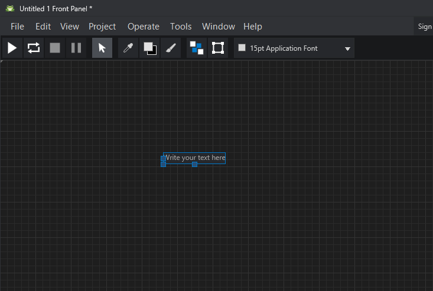
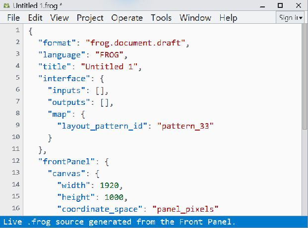

# Getting Started

This page describes the first path through Graiphic Studio.

## 1. Open Graiphic Studio

Launch Graiphic Studio and start from the Front Panel. The Front Panel is the
main design surface for placing controls, indicators, labels, images, and
interface-related editing affordances.

Graiphic Studio opens the Front Panel by default. The Block Diagram and Source
windows are complementary views of the same `.frog` document. `Ctrl+E` raises
the companion Front Panel or Block Diagram without resizing or moving the
current window. `Ctrl+Shift+E` opens the Source view, and `Ctrl+T` tiles the
Front Panel and Block Diagram when both must remain visible.

## 2. Place A Widget

Open the Widget Navigator, choose a widget family, then place a widget on the
grid.

Right-click an empty part of the Front Panel to open the Widget Navigator.
Single-click a family tile to browse its controls and indicators. Double-click
the family tile to start placement of its default widget, then click the Front
Panel to place it.

Current core families include:

- Numeric
- Boolean
- String and Path
- Ring and Enum
- Data Containers
- Image Static

Controls accept user input. Indicators display values. This distinction also
determines the direction of a future Interface Map binding.

## 3. Move And Resize

Drag a widget from its body or available frame. Drag a resize handle to change
its dimensions. Hold `Shift` while resizing to preserve proportions. When grid
snapping is active, placement follows the Front Panel grid.

Hold `Shift` while moving to constrain the motion horizontally or vertically.
Hold `Ctrl` through a drag to move a duplicate; releasing `Ctrl` before the
drop cancels the duplicate operation.

## 4. Edit A Label

Double-click an empty area on the Front Panel to create a label. A new label
starts with placeholder text so that an empty label is not accidentally kept.

If the label is validated with no text, the label is removed.

Press `Enter` to validate a label. Press `Shift+Enter` to insert a new line.
Widget labels use a magnetic default anchor: moving a detached label back near
its default position reconnects it naturally.

## 5. Save The Document

Save the document as a `.frog` file. The `.frog` document owns the source-level
state: widgets, layout, labels, bindings, interface map data, icon data, and
instance-level overrides.

The File menu provides New, Open, Close, Save, Save As, and Recent Files.
Recent Files is updated when a document is opened or saved successfully.

## 6. Place A Diagram Operation

Open the Block Diagram and its Function Navigator. Enter **Programming >
Numeric**, press and hold an operation tile, drag it onto the Diagram, then
release it at the desired position. The SVG preview follows the pointer during
the drag and the placed operation remains movable and selectable.

The resulting operation is an explicit Diagram node and is saved in
`diagram.nodes` with its FROG primitive identity and authored layout. Releasing
outside the Diagram or pressing `Escape` cancels the placement.

Only operations backed by published FROG primitive contracts can currently be
placed. See the [Function Navigator](interface/function-navigator.md) for the
complete workflow and current scope.

Front Panel widgets project typed terminals into the Block Diagram. Changing a
Numeric representation, switching Control/Indicator role, or encapsulating a
widget in an Array updates the corresponding terminal immediately.

## 7. Inspect The Source

Press `Ctrl+Shift+E` to open the Source view. It displays the live `.frog`
representation produced by the current Front Panel and Block Diagram. Use it
to verify widget properties, bindings, node types, authored layout, and view
state without treating editor-only selection state as executable data.

## 8. Configure The Studio

Open **Tools > Options...** to choose the interface theme, configure the Front
Panel grid, or manage SVG glyph folders used by the Icon Editor. The Appearance
page provides a live preview before a theme is applied.

These choices are local Studio preferences. They do not change FROG execution
semantics. See [Studio Options](interface/options.md) for the complete workflow.

## Next Steps

- Learn the [Front Panel](interface/front-panel.md).
- Learn how the three views cooperate in [Window Workflow](interface/window-workflow.md).
- Build and inspect dataflow in the [Block Diagram](interface/block-diagram.md).
- Inspect the serialized program in the [Source View](interface/source-view.md).
- Configure the IDE through [Studio Options](interface/options.md).
- Learn the [Interface Map](interface/interface-map.md).
- Learn how widgets are organized in the [Widget Navigator](interface/widget-navigator.md).
- Build dataflow operations with the [Function Navigator](interface/function-navigator.md).
- Place typed containers with the [Array Container](widgets/array-container.md).
- Organize complex panels with the [Selection Pane](interface/selection-pane.md).
- Customize the project icon in the [Icon Editor](interface/icon-editor.md).
