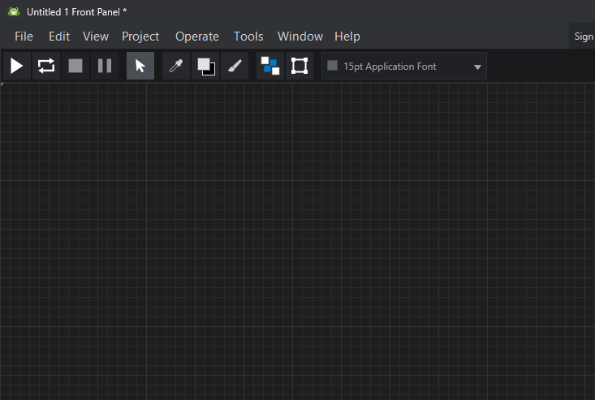

# Graiphic Studio Documentation

Welcome to the official user documentation for Graiphic Studio.

Graiphic Studio is a visual IDE for creating `.frog` documents. Its Front
Panel, Block Diagram, and Source windows are coordinated views of the same
program model. Users can design interfaces, build explicit dataflow, inspect
the source being produced, define an Interface Map, and edit the project icon.

## Start Here

- [Getting Started](getting-started.md)
- [Window Workflow](interface/window-workflow.md)
- [Front Panel](interface/front-panel.md)
- [Block Diagram](interface/block-diagram.md)
- [Source View](interface/source-view.md)
- [Studio Options](interface/options.md)
- [Widget Navigator](interface/widget-navigator.md)
- [Function Navigator](interface/function-navigator.md)
- [Interface Map](interface/interface-map.md)
- [Icon Editor](interface/icon-editor.md)

## Design And Organize

- [Selection Pane](interface/selection-pane.md)
- [Arrange and Resize](interface/arrange-and-resize.md)
- [Color Tools](interface/color-tools.md)

## Widget Documentation

- [Widgets Overview](widgets/index.md)
- [Numeric](widgets/numeric.md)
- [Boolean and Text Button](widgets/boolean-and-button.md)
- [String and Path](widgets/string-and-path.md)
- [Ring and Enum](widgets/ring-and-enum.md)
- [Array Container](widgets/array-container.md)
- [Image Static](widgets/image-static.md)

## Reference

- [Glossary](reference/glossary.md)
- [Screenshot Guide](reference/screenshot-guide.md)
- [Keyboard Shortcuts](reference/keyboard-shortcuts.md)
- [Document Model](reference/document-model.md)

## Documentation Philosophy

The Studio is documented from the user workflow outward:

1. What the user sees.
2. What action the user can perform.
3. What changes in the `.frog` document.
4. Which view reflects the change.
5. What the runtime will eventually consume.

This keeps the documentation practical while preserving the source model.
When a feature is Studio-only or deliberately deferred, the page says so.
