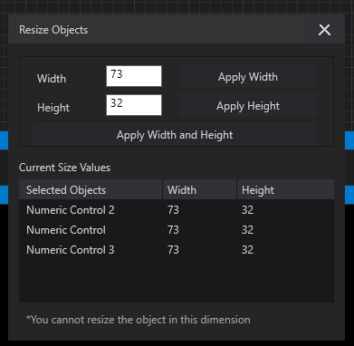

# Arrange And Resize

Arrange Objects provides consistent commands for stacking, grouping,
protecting, aligning, rotating, and sizing Front Panel content.

## Stacking

- Bring to Front moves the selection above all peers.
- Send to Back moves it below all peers.
- Bring Forward and Send Backward move it by one level.

## Group And Protect

Group requires at least two unlocked elements. Ungroup requires grouped
content. Lock and Unlock are mutually exclusive: only the command that can
change the current state is enabled.

The group aura encloses the current bounds of every member and updates after a
member moves or resizes.

## Align And Distribute

Alignment requires at least two eligible objects. Available commands align
left, center, right, top, middle, or bottom, and distribute horizontally or
vertically. Disabled commands appear at reduced opacity and cannot be hovered.

## Rotate And Flip

Rotate and Flip apply to SVG and image content. Rotation uses the object's
center. Horizontal and vertical flips remain relative to the displayed frame,
even after a rotation.

## Resize Objects

The Resize Objects palette provides six comparison commands:

- Maximum or Minimum Width
- Maximum or Minimum Height
- Maximum or Minimum Width and Height

These commands require at least two resizable objects. Maximum Width, for
example, gives every selected object the width of the widest member.

**Set Width and Height** opens a detailed window. Select rows in its table,
double-click one row to load its dimensions, then apply Width, Height, or both.
An asterisk marks a dimension the selected widget does not support.

Changes participate in `Ctrl+Z` history.
