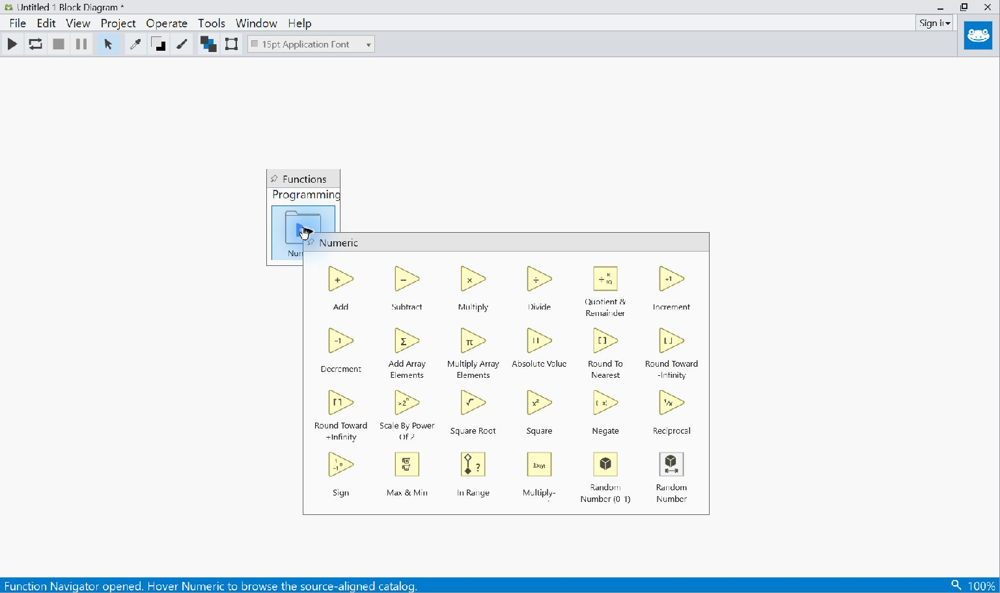

# Block Diagram

The Block Diagram is Graiphic Studio's executable dataflow authoring surface.
It displays typed widget terminals, operations placed from the Function
Navigator, comments, and the connections that will define execution order and
data movement.

## Canvas And Navigation

The Diagram uses a solid theme-coordinated background. It deliberately has no
editing grid. Hold the middle mouse button to pan. Diagram zoom is limited to
`60%` through `130%`; clicking either the zoom icon or percentage opens the
same menu below the status bar control.

Horizontal and vertical scrollbars appear when zoom or authored content extends
beyond the visible viewport. View navigation never changes executable meaning.

## Widget Terminals

Every participating Front Panel widget has a corresponding typed terminal.
Controls publish values to the graph; indicators receive values from it. A
terminal label is visible by default and can be hidden from **Visible Items >
Label** without renaming the widget.

Numeric terminals use the source-owned representation. Scalar and Array
terminals have distinct read/write SVGs while preserving the same element type
and family color. Changes made on the Front Panel are reflected immediately.

Use **Find Control** on a terminal to raise and highlight its Front Panel
widget. Use **Find Terminal** on the Front Panel for the reverse navigation.

## Operations

Open the [Function Navigator](function-navigator.md), browse **Programming >
Numeric**, and drag an operation onto the Diagram. The operation SVG follows
the pointer at reduced opacity and becomes fully opaque when placed.

Placed operations can be selected individually or with a selection rectangle,
moved with the mouse or arrow keys, copied, and deleted. Their selection
indicator is a restrained animated dashed contour derived from the exterior of
the SVG, not a rectangular Front Panel aura. Its geometry and animation are
identical in both themes: white on the dark Diagram and dark anthracite on the
light Diagram so selection remains visible without changing the operation SVG.

## Comments And Images

Double-click an empty Diagram area to create a comment. Comments are
source-owned annotations rather than widgets. Their temporary selection frame
exists only to move, resize, format, or delete the text.

Images can be pasted onto the Diagram as explicit visual objects. They remain
non-executable unless a separate node contract gives them semantics.

## Context Commands

The context menu depends on the selected Diagram object. Widget terminals
provide commands such as:

- **Visible Items > Label**
- **Find Control**
- **Change to Control** or **Change to Indicator**
- **Change to Array** for widget families that can become a typed Array
- **Representation** for typed Numeric terminals

Diagram labels are independently selectable. They can be moved, edited,
resized, formatted with the Application Font controls, or restored to their
object anchor without changing the terminal geometry. Diagram arrange,
ordering, grouping, and Selection Pane commands operate on the selected
Diagram objects and participate in Diagram undo/redo.

Operations and comments expose only commands relevant to those objects. The
Diagram never infers execution semantics from an icon color or selection state.

## What Is Saved

Executable operations are stored as explicit nodes with published primitive
types. Terminal identity, typed ports, edges, comments, and authored Diagram
layout are serialized in the `.frog` document. Pan, zoom, and useful reopen
state may be preserved as non-executable IDE metadata.
