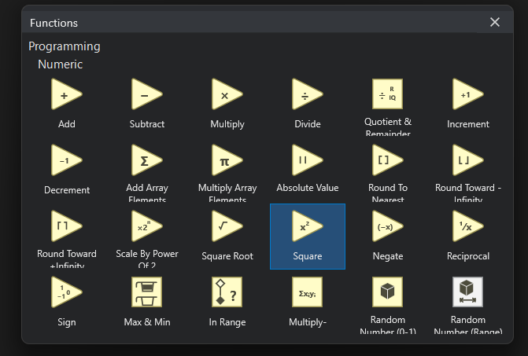

# Function Navigator

The Function Navigator is the Diagram counterpart of the Widget Navigator. It
browses dataflow functions, opens families, and starts placement on the Diagram.

The Numeric family presents its operations as compact, source-backed tiles.



## Hierarchy

The root Navigator groups functions by programming domain. Selecting
**Programming > Numeric** opens the current Numeric operations, including
arithmetic, rounding, range, random, and array-reduction functions.

The hierarchy behaves like the Widget Navigator: move into a family to open it,
choose a function to begin placement, and use `Escape` to cancel the active
placement command.

## Place A Numeric Operation

1. Open the Diagram, then open the Function Navigator from its toolbar button,
   from **View > Function Navigator**, or by right-clicking an empty part of the
   Diagram.
2. Open **Programming > Numeric**.
3. Press and hold the primary mouse button on an operation tile.
4. Drag the operation onto the Diagram. A live SVG preview follows the pointer
   when it enters the Diagram canvas.
5. Release the mouse button at the required position.

The operation becomes a Diagram node at the drop position. Releasing outside
the Diagram cancels the placement. Pressing `Escape` while dragging also
cancels it without changing the document.

A successful drop marks the document as modified. The transient Function
Navigator closes after placement; pinned Navigator windows remain independent
tool windows and can be opened again as needed.

## Available Operations

Graiphic Studio only creates executable nodes for operations whose primitive
identity is published by FROG. The first Numeric placement set includes core
arithmetic and the published scalar math operations represented in the
Navigator, such as addition, subtraction, multiplication, division, absolute
value, rounding, square root, square, negation, reciprocal, and sign.

Some catalog tiles intentionally remain discoverable before their source-level
primitive contract is published. Selecting one of those tiles reports that it
cannot yet be placed; Studio does not write an invented or invalid primitive
type into the document.

## Transient And Pinned Windows

An unpinned Navigator appears near the pointer and closes when the user clicks
elsewhere, presses `Escape`, or starts another command. Pinning keeps that
Navigator open as an independent Diagram tool window.

Pinned function windows use the same close control, sizing rules, theme, font
scale, tile spacing, and responsive reflow as pinned Widget Navigators. Several
pinned Navigator windows can remain open at the same time.

## Dataflow Role

Placing a function creates a Diagram node; it does not execute the operation
inside the palette. The Diagram remains the executable dataflow source, and the
runtime evaluates the placed node only when it participates in an executable
graph.

Numeric function icons describe operation semantics. Their connector types and
runtime behavior must remain compatible with the FROG source and runtime
contracts rather than being inferred from their visual color alone.

## What Is Saved

Each placed operation is stored in the canonical `.frog` Diagram as a
`kind = "primitive"` node. Its namespaced `type` identifies the operation and
its `layout` records the authored Diagram position and size. For example:

```json
{
  "id": "node_1",
  "kind": "primitive",
  "type": "frog.core.add",
  "layout": {
    "x": 120,
    "y": 80,
    "width": 48,
    "height": 48
  }
}
```

The SVG is presentation data used by Studio. The primitive `type`, Diagram
connections, and explicit ports will define execution semantics as the graph
editor progresses.
