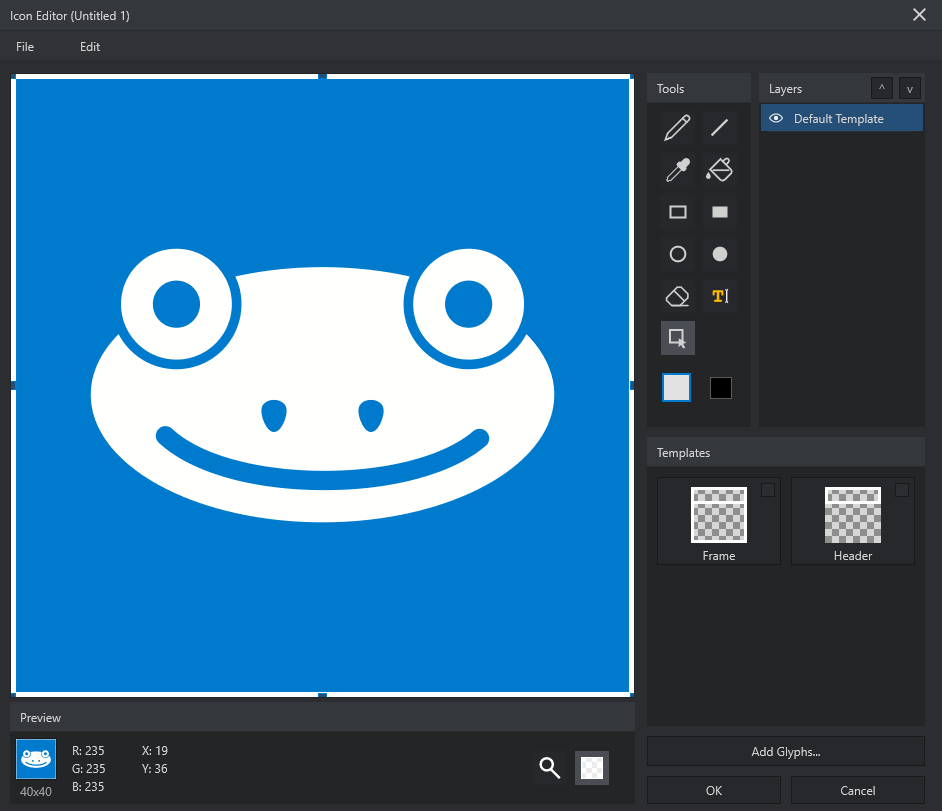

# Icon Editor

The Icon Editor edits the `.frog` document icon. Open it by double-clicking the
document icon in the Front Panel chrome or choosing **Edit Icon...** from its
context menu.

The 40 x 40 display is a preview size, not a raster limitation. SVG remains
vector-based and is rendered cleanly at other sizes.

The editor keeps drawing tools, layers, reusable templates, colors, and the
40 x 40 preview visible in one workspace.

## Canvas And Preview

The canvas uses a 40 x 40 working grid. One grid cell is the minimum Pencil and
Eraser unit. Vector objects can move outside the visible region while editing;
only the icon region appears in Preview and in the applied document icon.

Use View to choose a checkerboard or white editing background. This changes
the canvas background only. Zoom changes the editor view, not the SVG data.

## Layers

Content remains layer-based. Select a row, use its eye icon, drag it, or use the
arrow buttons to change visibility and stacking order. Layers can be copied,
pasted, nudged, resized, and deleted.

The Default Template and optional template layers follow the same interaction
rules as imported media and drawn objects. Layer metadata stays in the editable
SVG so work can continue after reopening the `.frog` document.

## Drawing Tools

- Pencil paints one-cell units on the selected layer.
- Line, Rectangle, and Ellipse create vector objects.
- Eyedropper samples a screen color into the active swatch.
- Fill replaces a connected region on the touched layer.
- Eraser removes cells from a layer without deleting that layer.
- Text creates an editable text object.
- Selection moves, resizes, copies, or deletes complete objects.

Fill uses four-directional connectivity. It changes the touched cell and every
connected cell of the same color on that exact layer; it never creates a second
layer for the fill result.

## Colors

The two swatches are independent quick colors. Click a swatch to activate it.
Double-click to open the single-color navigator. Drawing tools use only the
active swatch.

## Templates

Template tiles are optional helper layers. Activating a tile adds that template
to Layers. Templates remain non-destructive and can be moved, resized, hidden,
copied, reordered, or removed.

Reusable SVG glyph folders are managed through **Tools > Options... > Icon
Editor**. Adding a folder makes its SVG assets available to the local user
profile; removing the path from Options does not delete source files. See
[Studio Options](options.md).

## Import, Clipboard, And History

The File menu imports SVG or raster media. SVG stays vector-based. Clipboard
paste and drag-and-drop create an editable visual layer.

`Ctrl+Z` undoes; `Ctrl+Shift+Z` redoes. `Ctrl+Shift+Delete` clears all layers.
Press `Escape` to leave the current tool and return to selection without
closing the editor.

## Apply Or Cancel

**OK** writes the current Preview to the `.frog` icon and preserves editable
layer data. **Cancel** closes the editor without applying the session.
