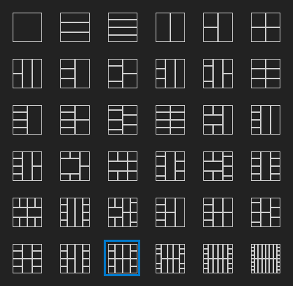

# Interface Map

The Interface Map is the square representation in the Front Panel chrome. It
shows the public `.frog` interface layout without turning that layout into
hidden runtime behavior.

## Vocabulary

- **Interface Map** is the square showing public interface slots.
- **Interface Layout Pattern** is the selected distribution of those slots.
- **Front Panel binding** is the explicit link between a widget value and a public port.
- **interface_input** and **interface_output** are the future Diagram projections of public ports.

## Create A Binding

1. Click an empty slot. The slot enters binding mode.
2. Move to a compatible Front Panel widget. Its thicker aura confirms the target.
3. Click the widget. The binding is stored and binding mode ends.

The binding cursor and candidate aura share the same highlight color. Press
`Escape` before choosing a widget to cancel. Clicking a bound slot selects its
widget and can re-enter binding mode so the association can be changed.

Each widget value has one Front Panel binding. Binding an already-bound widget
to another slot moves the association and clears its previous slot. Deleting a
bound widget removes the binding.

## Slot Colors

Slots use data-type colors: Double is orange, Integer is blue, Boolean is green,
String is pink, Path is blue-green, and Ring or Enum uses integer blue.

A required connection adds a red marker on the slot's exterior edge.
Recommended and optional connections keep the normal display. For corner slots,
the marker follows the left or right flow edge; top and bottom markers are used
for slots whose exterior connection is strictly above or below.

## Patterns And Capacity

Patterns define only visual distribution. Choosing a pattern, rotating it, or
flipping it transforms the visible slots and their hit areas together. Existing
bindings are preserved in order while capacity allows. Extra bindings are
removed when the new pattern has fewer available slots.

Add Terminal and Remove Terminal choose the next compatible capacity while
preserving bindings within that limit.

## Swap And Disconnect

After selecting a bound slot, hold `Ctrl` over another slot to enter Swap mode.
Swap works between two occupied slots and between an occupied and empty slot.

Use **Disconnect This Terminal** for one slot or **Disconnect All Terminals** to
clear the map.

## Source Ownership

The selected pattern and bindings are explicit `.frog` data. The Interface Map
is an editor for that data, not an invisible execution mechanism. The Diagram
remains the authoritative executable graph.
