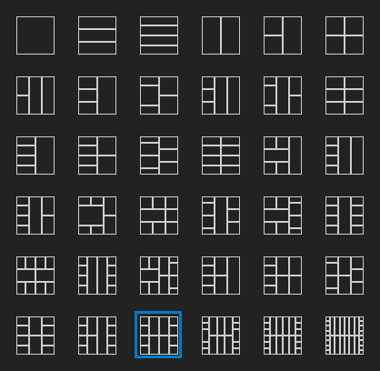
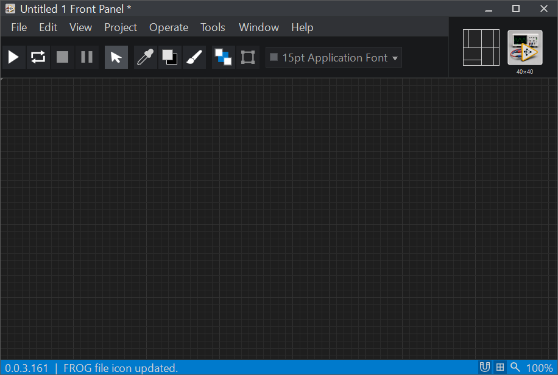

# Interface Map

The Interface Map is the slot representation in the Front Panel chrome. It
shows the public `.frog` interface layout without turning that layout into
hidden runtime behavior.



## Vocabulary

- **Interface Map** is the rectangle showing public interface slots.
- **Interface Layout Pattern** is the selected distribution of those slots.
- **Front Panel binding** is the explicit link between a widget value and a public port.
- **interface_input** and **interface_output** are the future Diagram projections of public ports.

## Create A Binding

1. Click an empty slot. The slot enters binding mode.
2. Move to a compatible Front Panel widget. Its thicker aura confirms the target.
3. Click the widget. The binding is stored and binding mode ends.

The binding cursor and candidate aura share the same highlight color. Press
`Escape` before choosing a widget to cancel. Clicking a bound slot selects its
widget and can re-enter binding mode so the association can be changed.

Each widget value has one Front Panel binding. Binding an already-bound widget
to another slot moves the association and clears its previous slot. Deleting a
bound widget removes the binding.

## Slot Colors

Slots use data-type colors: Double is orange, Integer is blue, Boolean is green,
String is pink, Path is blue-green, and Ring or Enum uses integer blue.

A required connection adds a red marker on the slot's exterior edge.
Recommended and optional connections keep the normal display. For corner slots,
the marker follows the left or right flow edge; top and bottom markers are used
for slots whose exterior connection is strictly above or below.

## Patterns And Capacity

Patterns define only visual distribution. Choosing a pattern, rotating it, or
flipping it transforms the visible slots and their hit areas together. Existing
bindings are preserved in order while capacity allows. Extra bindings are
removed when the new pattern has fewer available slots.

Add Terminal and Remove Terminal choose the next compatible capacity while
preserving bindings within that limit.

## Custom Layouts

Choose **Create...** or **Modify...** in the Custom pattern menu to open
**Custom Pattern**, set a width and height between 32 and 1024 logical pixels
and arrange your own perimeter slots. The icon size selector controls the
document icon; it is not the pattern creation action.

Drag a numbered binding onto a striped green zone. Red zones mark insufficient
spacing or a corner exclusion. The pointer is an interaction hand on hover and
a closed hand only while dragging. Invalid drops keep the previous position.

**Bindings** shows the active count. Increasing it uses available space without
moving existing bindings; it stops when no further placement is possible.
Use the minus action on a binding to remove that slot, or **Reset** to restore
the layout from when the dialog opened. **Cancel** discards the dialog changes.
Removing an assigned slot also clears its association when the edit is applied;
it does not transfer that association to a different slot.

Click the Custom map to assign Front Panel widgets in the numbered binding
dialog. Controls provide inputs and indicators provide outputs. Unlike the
standard direct rebinding gesture, that dialog rejects duplicate assignments;
choose **Unassigned** explicitly when clearing an association.

The following Studio 0.0.3.161 capture shows a Custom 40 × 40 document. The map
and icon use the available toolbar preview area; the label retains the actual
40 × 40 dimensions.



Size, slot identities, explicit positions and disabled slots are saved in the
document. See [Custom Binding Persistence](../reference/custom-bindings.md) for
the exact fields and supported descriptor versions.

## Swap And Disconnect

The current Custom menu uses **Create...** for a new pattern and **Modify...**
for an existing custom pattern; both open **Custom Pattern**. **Saved Pattern**
opens the saved-pattern list. In that dialog, **Save** writes the current pattern
and keeps the dialog open without applying it. **Save Apply** saves, applies and
closes. Saving/validation errors keep the dialog open. These recent changes and
their qualification limits are recorded in the
[development checkpoint](../reference/development-checkpoint.md).

After selecting a bound slot, hold `Ctrl` over another slot to enter Swap mode.
Swap works between two occupied slots and between an occupied and empty slot.

Use **Disconnect This Terminal** for one slot or **Disconnect All Terminals** to
clear the map.

## Source Ownership

The selected pattern and bindings are explicit `.frog` data. The Interface Map
is an editor for that data, not an invisible execution mechanism. The Diagram
remains the authoritative executable graph.

The selected layout is stored at document level. The fragments below describe
Studio's saved authoring data. The current writer uses `frog.document.draft`;
its `.frog` extension does not establish canonical source conformance. See
[Document Model](../reference/document-model.md) for the format boundary.

```json
"interface": {
  "map": {
    "layout_pattern_id": "pattern_33",
    "visual_transforms": ["rotate_90_clockwise"]
  }
}
```

Each bound widget stores its own public-port and slot correspondence:

```json
"binding": {
  "mode": "widget_value",
  "public_input_id": "numeric_control",
  "interface_map_slot": "zone_4",
  "connection_requirement": "recommended"
}
```

An indicator uses `public_output_id` instead of `public_input_id`. The slot id
is resolved against the selected pattern and its transforms; pixel hit areas
are never source truth. Connection requirements are semantic source data,
while their red required-edge marker is only a visual projection.

## Array Binding Migration

An empty Array has no element type and cannot be bound. If a bound scalar
widget is dropped into an Array, the association moves atomically to the Array:

- the Array inherits direction, public port, slot, and connection requirement;
- the public type becomes the matching Array type;
- the Diagram terminal and Interface Map type color update immediately;
- the contained element template does not keep a duplicate scalar binding.

Removing the contained widget makes the Array untyped again and clears the
binding that can no longer be valid.

The normative source contract is defined by the public FROG specification in
[Interface Map](https://github.com/Graiphic/FROG/blob/main/Expression/Interface%20map.md).
