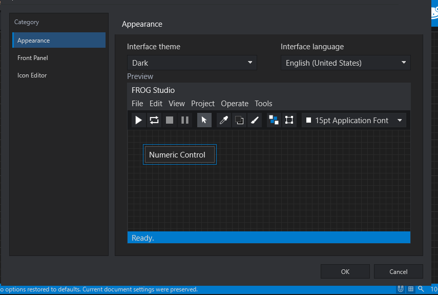
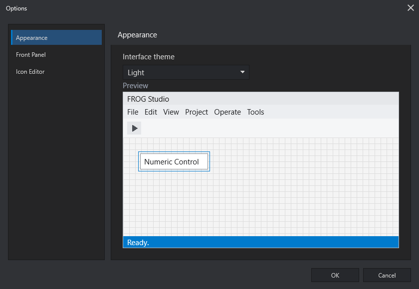
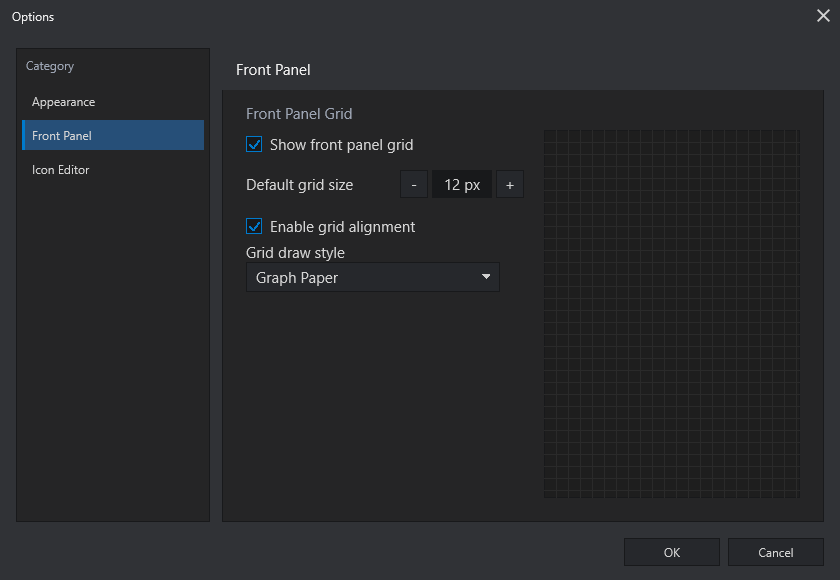

# Studio Options

Open **Tools > Options...** to configure Graiphic Studio without changing the
execution meaning of the current `.frog` document.

The Options window is divided into three categories: Appearance, Front Panel,
and Icon Editor. **Apply** commits changes without closing the window, while
**OK** commits and closes it. **Cancel** and the close button leave unapplied
changes unchanged.



## Appearance

Appearance selects the interface theme. The current release provides **Dark**
and **Light** profiles. Selecting a profile updates the preview immediately so
you can inspect the title area, menus, execution and editing icon families,
font control, Front Panel, widget selection, grid, and status bar before
applying it.

**Interface language** is available beside the theme selector. The choices are
**English (United States)**, **French**, **Italian**, **Chinese (Simplified)**,
**Japanese**, **German**, and **Spanish**. Simplified Chinese is used for the
Chinese profile.

**Interface font size** provides three global levels:

- **Small** keeps the original compact 9 pt interface.
- **Medium** uses 11 pt.
- **Large** uses 13 pt.

The preview reflects the selected size immediately. Press **Apply** to update
open menus, palettes, dialogs, the Icon Editor, and inline controls without
closing Options. The choice is restored in future Studio sessions.

The Widget Navigator follows the same setting: its popup, tiles, icons,
labels, spacing, and family views become compact at **Small**, intermediate at
**Medium**, and expanded at **Large**. The expanded layout reserves enough
space for complete family and widget names. Transient navigator windows resize
as soon as the setting is applied. A pinned navigator that you resized manually
keeps its window size and reorganizes the scaled tiles within it; Studio only
grows it when the selected font no longer fits its current bounds. Toolbar text
controls and the status zoom value also reserve more width at larger levels.

Both built-in themes use the same visual hierarchy: headers are deliberately
distinct from window and panel bodies, with a fine divider between them. This
applies consistently to Options, Widget Navigator, Icon Editor, Resize
Objects, Selection, Ring/Enum Items, and Color Navigator.

The Light profile also separates menu, toolbar, panel, control, hover, active,
disabled, grid, border, and selection tones. Secondary labels stay readable
without looking as strong as primary text. The source window switches to a
coordinated light editor and gutter with syntax colors chosen for contrast;
scrollbars and widget outlines follow the same profile rather than retaining
dark-only colors.



Theme colors are profile-based rather than embedded in individual windows.
This keeps the shell, menus, popups, palettes, editors, text, icons, and
interaction states on one shared visual system. Additional profiles can be
added without redefining `.frog` source semantics.

## Front Panel

Front Panel options configure the editing grid:

- **Show front panel grid** controls grid visibility.
- **Default grid size** sets the grid pitch in pixels.
- **Enable grid alignment** enables snap-to-grid placement.
- **Grid draw style** selects **Lines**, **Dots**, or **Graph Paper**.



Pressing **OK** applies these values to the current Front Panel and stores them
as defaults for a new document. Grid appearance and snapping are editing
preferences; widget placement stored in a saved `.frog` document remains
explicit source-owned layout.

## Icon Editor

The Icon Editor category manages folders that contain reusable SVG glyphs.

- **Add Folder...** selects a folder containing SVG assets.
- Double-click a listed path to edit it in place. Press `Enter` to keep the
  change or `Escape` to cancel the inline edit.
- Selecting a listed path enables **Remove**.
- **Remove** forgets the folder from the local profile; it does not delete the
  folder or any SVG file from disk.

Configured folders are available again the next time Graiphic Studio starts.
If the Icon Editor is already open, applying Options refreshes its glyph
library immediately.

## Preference Storage

Studio preferences are stored in the local user profile:

```text
%APPDATA%\Graiphic\Frog Engine 1.0\frog-studio.ini
```

The selected theme, interface font size, Front Panel grid defaults, and
glyph-folder list are Studio preferences. They do not become hidden runtime
behavior and do not replace source-owned `.frog` document properties.
