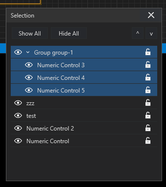

# Selection Pane

The Selection Pane is the structural view of Front Panel content. Open it from
Arrange Objects. It lists widgets, labels, images, and groups in stacking order.
The command is unavailable when the document contains no selectable element.

## Select Objects

Click a row to select that object on the Front Panel. Hold `Shift` to select
several rows. Selection updates immediately when the Front Panel selection,
grouping, visibility, lock state, or stacking order changes.

Use the eye button to show or hide an element. Use the lock button to protect or
release its layout. **Show All** and **Hide All** update the complete list.

## Groups

Groups appear as expandable tree rows. Click the chevron to show or hide their
children. Clicking the group row selects the whole group; clicking a child
selects only that element.

Drag an element into a group, out of a group, or to another position. A single
insertion line shows the drop destination. The row under the pointer is not
also highlighted during a drag, which keeps the destination unambiguous.

Right-click a valid multi-selection to Group. Right-click grouped content to
Ungroup. Commands that do not apply are disabled and do not receive hover
feedback.

## Stacking Order

Rows follow the Front Panel stacking order. Drag a row or use the up/down
buttons to move content forward or backward. Changes appear immediately on the
canvas.

## Locked Objects

Lock protects geometry and appearance, not runtime interaction. A locked widget
still works as a control or indicator. Its Front Panel aura changes color and
resize handles disappear. Unlock is the only editing command available until
the object is released.
