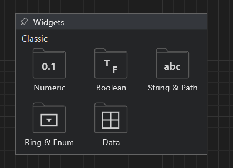

# Widget Navigator

The Widget Navigator browses widget families and starts placement on the Front
Panel. It can appear temporarily at the pointer or remain open as a pinned tool
window. Popup dimensions follow their content and the active monitor work area.

The root view groups the current widget families into compact, scannable tiles.

## Families

Current families include Numeric, Boolean, String and Path, Ring and Enum, and
Data Containers. Family tiles use rows of three where space allows and carry a
visual symbol for fast scanning.

Clicking a family opens its choices. Clicking a family as a direct placement
action chooses its default widget:

- Numeric places Numeric Control.
- Boolean places Text Button.
- String and Path places String Control.
- Ring and Enum places Ring Control.
- Data Containers places Array.

## Controls And Indicators

A **Control** accepts interaction and provides a value. An **Indicator**
displays a value and omits command-only affordances. For example, Path Control
has a browse button while Path Indicator does not.

Ring and Enum share one family because both expose a named selection backed by
a value. Its submenu contains Ring Control, Ring Indicator, Enum Control, and
Enum Indicator.

## Place Or Cancel

After choosing a widget, its preview follows the pointer until the Front Panel
is clicked. Press `Escape` to cancel. Repeated default labels receive numeric
suffixes so every object stays identifiable.

Click outside an unpinned Navigator, press `Escape`, or begin another command
to close it. Pinning turns it into a persistent window with the standard
Graiphic Studio close button.

Pinned Navigators are independent: opening another Navigator does not close an
existing pinned window. A pinned window can be resized, and its tiles reflow to
the available width while preserving the active interface font scale.
