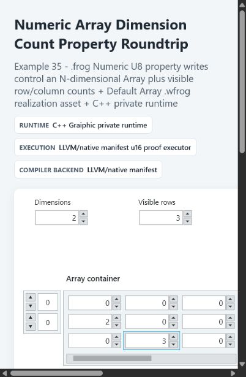
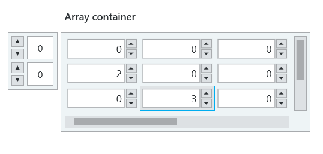

# Array Container

Array is a typed Front Panel container. It repeats one embedded widget template
over one or more dimensions while keeping one coherent array value in the
`.frog` document and runtime.

The canonical runtime example below shows two dimensions, three visible rows,
numeric cells, connected index displays, and scrollbars for content outside the
visible extent.

## Create And Type An Array

Place **Data Containers > Array** from the Widget Navigator. A new Array starts
as a one-dimensional empty square container with no scrollbars. Its dashed
placeholder is not a value cell. Drag a supported widget into the content
region to define the element template. Numeric, String, Path, Boolean, Text
Button, Enum, and Ring templates preserve their own value and appearance rules.

During the drag, the widget is drawn above the Array so the drop target remains
visible. Once accepted, the source widget becomes the Array template and its
standalone Diagram terminal is replaced immediately by the matching typed
Array terminal.

All cells in one Array use the same embedded widget template. Resizing the
template changes the cell size; resizing the Array changes how many rows and
columns are visible.

The focused two-dimensional view makes the separation between index controls,
typed cells, and scrollbars explicit.

## Dimensions And Indices

Each dimension has a compact numeric index display. Indices are interactive:
type a coordinate or use increment and decrement to choose the visible slice.
The dimension controls use the same immediate interaction behavior as a Numeric
widget.

A one-dimensional Array displays one axis. Starting at two dimensions, the
Array displays a row-and-column grid; additional dimensions select higher-order
slices through their index displays.

Extending an Array coordinate extends its dense shape. Missing positions before
the new coordinate receive the embedded widget's default value instead of
remaining visually active but absent.

Cells beyond the current shape remain visible only as disabled placeholders.
Clicking one selects its template surface; it does not activate the cell. The
shape changes only after a value is committed or an increment/decrement command
changes that coordinate.

## Edit Cells

An active cell behaves like its embedded widget. Numeric cells accept text,
increment and decrement, representation options, context-menu actions, and
color editing. Showing the embedded label adds label space inside every visible
cell and therefore changes row layout.

Selecting a cell targets the embedded widget. Selecting the surrounding frame
targets the Array container. The two targets intentionally expose different
resize, visibility, color, and context-menu actions.

The embedded widget keeps its complete context menu. Copying a selected cell
copies the widget template. Deleting that selected template returns the Array
to its initial empty state; it does not leave an untyped active cell behind.

Showing an embedded widget label reserves label height inside every repeated
cell. Labels can be selected and edited, and the Array frame expands so all
repeated labels and bodies remain enclosed.

## Resize And Scroll

The Array frame provides independent controls for visible rows and columns.
Scrollbars appear only when the current shape extends beyond the visible grid.
Their ranges follow the array shape and selected higher-dimensional slice.

For a one-dimensional Array, the resize direction also chooses the visible
orientation. Start from the single-cell posture and drag primarily downward to
create a vertical column, or primarily to the right to create a horizontal
row. The element template keeps the same size in both layouts; Studio changes
only the repeated axis and visible count. Two-dimensional and higher-rank
Arrays always use the row-and-column grid posture.

The selected orientation is source-owned as `viewport.orientation` and is
restored with the document. It does not transpose or otherwise modify the
semantic Array value.

Array background and border colors belong to the container. Cell body, border,
spinner, label, and text colors belong to the embedded widget template.

## Diagram And Binding

An empty Array has no element type, so it cannot be bound and does not expose a
typed Diagram terminal. Once a widget is encapsulated, the Array inherits that
widget's value type, terminal family, and Interface Map color. Numeric Arrays
also inherit the selected Numeric representation.

If the widget was already bound before encapsulation, Studio transfers the
binding to the new Array object and updates the Interface Map immediately. The
old scalar binding is not left behind. Removing the embedded template removes
the resulting typed binding because the Array becomes untyped again.

Use **Change to Indicator** or **Change to Control** on the Array to switch the
container role. Its Diagram terminal changes read/write posture without
changing the element type.

## Runtime Contract

The Studio edits source-owned dimensions, shape, values, visible counts,
indices, template properties, and instance styling. The runtime consumes that
same Array value and applies the behavior demonstrated by the reference
examples; the editor does not invent a second array model for display purposes.
