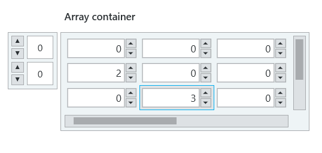

# Array Container

Array is a typed Front Panel container. It repeats one embedded widget template
over one or more dimensions while keeping one coherent array value in the
`.frog` document and runtime.

The current Studio view keeps the index controls, repeated typed cells, and
scrollbars inside one source-owned Array instance. The Default Array manifest
provides its initial geometry and colors; each repeated cell uses the embedded
widget's own Default realization rather than a reduced Array-specific copy.

## Create And Type An Array

Place **Data Containers > Array** from the Widget Navigator. A new Array starts
as a one-dimensional empty square container with no scrollbars. Its dashed
placeholder is not a value cell. Drag a supported widget into the content
region to define the element template. Numeric, String, Path, Boolean, Text
Button, Enum, and Ring templates preserve their own value and appearance rules.

During the drag, the widget is drawn above the Array so the drop target remains
visible. Once accepted, the source widget becomes the Array template and its
standalone Diagram terminal is replaced immediately by the matching typed
Array terminal.

All cells in one Array use the same embedded widget template. Resizing the
template changes the cell size; resizing the Array changes how many rows and
columns are visible.

For widget-backed cells, the cell envelope is the contained widget's
`placement_bounds`. Array does not add a second padding skin around it. Cell
hover and selection belong to Array, while keyboard focus remains owned by the
contained widget realization.

The focused two-dimensional view makes the separation between index controls,
typed cells, and scrollbars explicit.

## Dimensions And Indices

Each dimension has a compact numeric index display. Indices are interactive:
type a coordinate or use increment and decrement to choose the visible slice.
The dimension controls use the same immediate interaction behavior as a Numeric
widget.

A one-dimensional Array displays one axis. Starting at two dimensions, the
Array displays a row-and-column grid; additional dimensions select higher-order
slices through their index displays.

Extending an Array coordinate extends its dense shape. Missing positions before
the new coordinate receive the embedded widget's default value instead of
remaining visually active but absent.

Cells beyond the current shape remain visible only as disabled placeholders.
Clicking one selects its template surface; it does not activate the cell. The
shape changes only after a value is committed or an increment/decrement command
changes that coordinate.

## Edit Cells

An active cell behaves like its embedded widget. Numeric cells accept text,
increment and decrement, representation options, context-menu actions, and
color editing. Showing the embedded label adds label space inside every visible
cell and therefore changes row layout.

Selecting a cell targets the embedded widget. Selecting the surrounding frame
targets the Array container. The two targets intentionally expose different
resize, visibility, color, and context-menu actions.

The embedded widget keeps its complete context menu. Copying a selected cell
copies the widget template. Deleting that selected template returns the Array
to its initial empty state; it does not leave an untyped active cell behind.

Showing an embedded widget label reserves label height inside every repeated
cell. Labels can be selected and edited, and the Array frame expands so all
repeated labels and bodies remain enclosed.

## Resize And Scroll

The Array frame provides independent controls for visible rows and columns.
Scrollbars appear only when the current shape extends beyond the visible grid.
Their ranges follow the array shape and selected higher-dimensional slice.

For a one-dimensional Array, the resize direction also chooses the visible
orientation. Start from the single-cell posture and drag primarily downward to
create a vertical column, or primarily to the right to create a horizontal
row. The element template keeps the same size in both layouts; Studio changes
only the repeated axis and visible count. Two-dimensional and higher-rank
Arrays always use the row-and-column grid posture.

The selected orientation is source-owned as `viewport.orientation` and is
restored with the document. It does not transpose or otherwise modify the
semantic Array value.

Array background and border colors belong to the container. Cell body, border,
spinner, label, and text colors belong to the embedded widget template.

## Diagram And Binding

An empty Array has no element type, so it cannot be bound and does not expose a
typed Diagram terminal. Once a widget is encapsulated, the Array inherits that
widget's value type, terminal family, and Interface Map color. Numeric Arrays
also inherit the selected Numeric representation.

If the widget was already bound before encapsulation, Studio transfers the
binding to the new Array object and updates the Interface Map immediately. The
old scalar binding is not left behind. Removing the embedded template removes
the resulting typed binding because the Array becomes untyped again.

Use **Change to Indicator** or **Change to Control** on the Array to switch the
container role. Its Diagram terminal changes read/write posture without
changing the element type.

## Boolean Constants On The Block Diagram

The following behavior was prepared on 19 September 2026. Its original evidence
belongs to that dated lot. The current local delivery and qualification limits
are in the [development checkpoint](../reference/development-checkpoint.md);
the earlier 0.0.3.174 version is not the current executable.

A click inside a Boolean Array Constant cell toggles **False/True**, including
rapid repeated clicks and clicks while the Array is selected. The narrow cell
border selects the element and starts its extraction gesture. The surrounding
Array frame selects or moves the complete container. Hover uses the interaction
pointer; the closed hand is used when holding an element to drag it.

After extraction, inserting a constant back into the empty Array preserves its
displayed row/column counts, orientation and iterator-column width. The complete
grid and iterator stack determine the frame size, keeping every index accessible.
The existing extraction rule still clears the Array's element type and stored
values; the extracted constant carries the selected cell's value. This layout
correction does not change that rule or the `.frog` format.

## Runtime Contract

Studio edits dimensions, shape, values, visible counts, indices and template
properties. A supported runtime must consume the declared array value and rank
through its source/profile contract. Editor rendering alone does not establish
runtime support for every nested element type or dimension.

## Element Gap And Widest Sizing

**Add Element Gap** enables spacing between repeated cells; the menu then offers
**Remove Element Gap**. **Size to Widest Element** measures the widest content and
resizes the shared element template with a small margin. It is a one-shot action:
after changing a value, invoke it again to update the width. It does not enable an
automatic Size to Text mode or change the array's values, rank or logical order.

Nested arrays inside a cluster in an array of clusters retain cell editing.
The edited cell updates the correct parent element rather than the shared
template or another row. Current qualification limits remain in the checkpoint.
