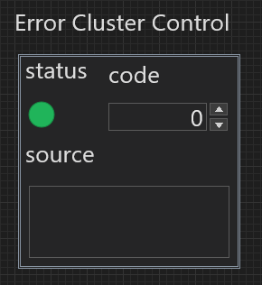
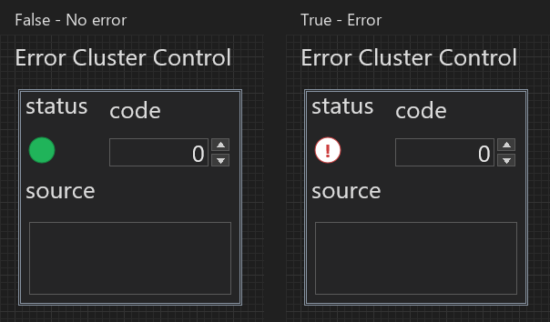

# Error Cluster

Choose **Error Cluster Control** or **Error Cluster Indicator** from the Widget
Navigator's **Data Containers** category. Each preset places a real Cluster
containing three ordinary widgets.

The default arrangement puts a round status LED at the upper left, the numeric
code beside it, and a larger source text area across the row below.

## Fields

| Field | Widget | Value type | Initial value |
| --- | --- | --- | --- |
| `status` | Round LED: green for `false`, red outline and `!` for `true` | Boolean | `false` |
| `code` | Numeric | Signed 32-bit integer | `0` |
| `source` | String, with a taller text area | String | Empty |

The field order remains `status`, `code`, `source`, independently of their
positions. The resulting type is
`cluster<status:bool,code:i32,source:string>`. Moving a field does not change
that type or turn the cluster into three independent top-level controls.

## Editing And Appearance

The Control preset gives its contained fields the control role; the Indicator
preset gives them the indicator role. The LED uses the existing Round LED
realization with a presentation specific to the Error preset:

- **No error (`false`)**: a filled green circle without text.
- **Error (`true`)**: a red circular outline and centered red **!** on a neutral
  white face. The symbol makes the state recognizable without relying on color
  alone.

These states follow the Boolean `status` value. They do not infer an error from
`code` or change the values of the other fields. The colors, state text and
centered text setting use existing per-widget properties saved in the `.frog`
document. Ordinary Round LEDs keep their existing defaults.

Numeric and String fields retain their normal Studio rendering,
editing rules and theme colors.

The contained labels are editable independently: double-click a label to
rename it, or drag it to move the label without moving its widget. Their
context menus retain the ordinary Boolean, Numeric or String properties.
The initial `status` and `code` labels share a baseline, and all three labels
sit close to their fields. A label change preserves the field's technical ID.

The default has **AutoSizing: None**, keeping the two-row composition in place.
You can move or resize the contained widgets, or choose a Cluster AutoSizing
mode explicitly. Labels and the numeric control's step buttons are included
in the initial spacing so they stay inside the frame.

The new layout is used when creating an Error preset. Reopening an existing
document preserves the positions and appearance saved in that document.
Save/reopen and Undo/Redo retain the three fields, their roles, values and
the circular LED asset and both status appearances.

In the Widget Navigator, the two Error icons remain monochrome rectangular
symbols; they represent the composite widget rather than a miniature rendering
of every contained field.

## Constants On The Block Diagram

**Create Constant** on an Error Cluster terminal creates a separate editable
Cluster constant. **Change to Constant** replaces the terminal and its paired
Front Panel widget, retaining the terminal's diagram identity and existing
wires. Both actions preserve the three field values, their types and stable
field IDs. Undo/Redo restores the complete change across both panels.

The Diagram uses a compact vertical composition: a rectangular **F/T** Boolean
field, an **I32** numeric field, and a **String** field. Their labels are hidden
initially, and the default `false / 0 / empty` triplet occupies 28 × 80 diagram
units. Nonempty source text and wider numeric values can grow the fields using
the normal constant text sizing. The Front Panel layout and LED appearance are
independent of this presentation.

The constant remains an ordinary editable Cluster: its values and labels can
be edited, fields can be moved, and its AutoSizing mode can be changed. The
previous unmodified 60 × 96 Error preset is compacted when loaded; customized
field layouts are preserved. Error Array presets use the same compact field
composition.
