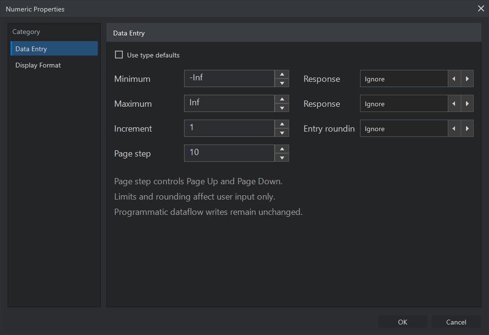
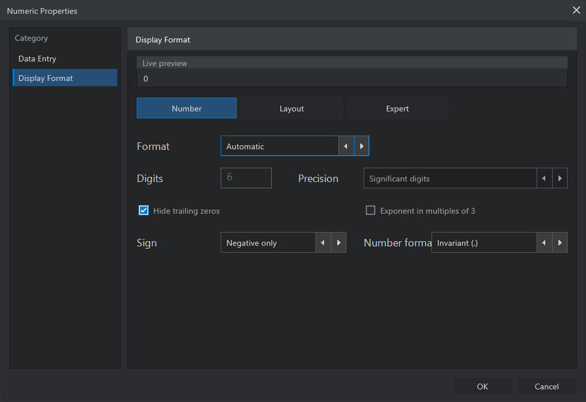

# Numeric Widget

The Numeric widget displays or edits a numeric value.

## Variants

- Numeric Control
- Numeric Indicator

## Visible Items

The Numeric widget can show or hide:

- Label
- Increment/Decrement controls

Increment/Decrement controls may be placed on the left or right. Selecting the
currently active side again hides them.

The control accepts direct value editing. The indicator presents the value
without offering input interaction.

## Resize

Numeric widgets resize horizontally. The label follows its default anchor while
it remains anchored.

The height is fixed for the compact numeric style. Resize Objects marks this
dimension with an asterisk rather than pretending the widget can change it.

Brush can recolor the numeric body and border. The increment/decrement pair is
one linked surface: its rectangle and triangle expose fill and border mappings.

## Context Menu

Numeric widgets expose a context menu for visible items and control/indicator
switching. The menu groups role and structure commands separately from Numeric
configuration. **Change to Array** replaces the scalar widget with a typed
Array that embeds the same Numeric template and representation.

### Data Entry



Choose **Data Entry...** to define optional minimum and maximum values,
increment behavior, and page step. Each enabled limit declares how an entered
value is handled. **Ignore** accepts the value when the selected numeric type
can represent it. **Coerce** clamps it to the corresponding boundary. Minimum
and maximum responses are independent.

Numeric Properties follows the same navigation model as **Tools > Options**.
Choose **Data Entry** or **Display Format** from the category list on the left.
The property page on the right scrolls vertically when the window is too short,
while **OK** and **Cancel** remain available at the bottom.

Clear **Use type defaults** to edit custom entry rules. Press **OK** to validate
and apply the complete page. Invalid limits or steps keep the window open and do
not partially modify the widget.

The numeric type always has priority. An unsigned type such as `U16` rejects a
negative value. Integer types store whole values and apply the selected entry
rounding posture. Floating-point types accept signed fractional values within
their representation domain.

Increment response can accept an off-grid value or round it to the nearest,
next higher, or next lower increment. The grid starts at the custom minimum
when one is configured, otherwise at zero. An increment of zero disables this
custom quantization while leaving the increment/decrement buttons usable with
their natural step. **Page step** is used by Page Up and Page Down.

An exact minimum or maximum remains reachable even when it does not fall on the
increment grid. A value brought to that boundary by **Coerce** remains on the
boundary instead of being moved away by increment rounding.

Examples:

| Setup | Entered value | Committed value |
| --- | ---: | ---: |
| Float64, range `0..10`, both limits coerced | `11` | `10` |
| Float64, range `0..10`, maximum ignored | `12` | `12` |
| UInt16 | `-1` | rejected |
| UInt16, nearest rounding | `12.6` | `13` |
| UInt16, downward rounding | `12.9` | `12` |

The standard interactive editor also rejects `NaN` and infinite text. These
values require explicit handling when they enter the application through
programmatic dataflow.

Data-entry rules are part of the widget source. They are validated when the
user commits a value and are serialized as `data_entry.*` properties rather
than retained as private Studio preferences. Applying new settings does not
rewrite the value already displayed. Programmatic Diagram/runtime writes bypass
Data Entry policy and remain governed by the numeric representation contract.

The explicit `.frog` form is:

```json
{
  "data_entry.use_type_defaults": false,
  "data_entry.minimum": 0,
  "data_entry.maximum": 100,
  "data_entry.minimum_response": "coerce",
  "data_entry.maximum_response": "ignore",
  "data_entry.increment_step": 1,
  "data_entry.increment_response": "nearest",
  "data_entry.page_step": 10
}
```

### Display Format



Choose **Display Format...** to control value presentation without changing
the stored numeric type or value. The live preview uses the same formatter as
the Front Panel, so every change can be checked before pressing **OK**.

The page keeps the live preview visible and groups the remaining controls into
three views:

- **Number** for notation, precision, and exponent behavior;
- **Layout** for sign, locale, width, padding, alignment, prefix, and suffix;
- **Expert** for radix details and a validated custom format.

Fields that do not apply to the current notation or numeric representation are
disabled. This makes the active consequences explicit instead of accepting a
setting that the widget would ignore.

Available notations are Automatic, Fixed, Scientific, Engineering, SI,
Decimal, Hexadecimal, Binary, expert Octal, and Custom. **Fractional digits**
counts digits after the decimal separator. **Significant digits** counts the
meaningful digits across the complete value. Trailing zeros can be retained to
show visual resolution or hidden for a compact result.

The advanced presentation controls provide:

- negative-only, always-visible, or reserved-space sign display;
- minimum field width without truncation;
- spaces or zeros for padding;
- left or right alignment;
- invariant or system decimal separator;
- decorative prefix and suffix text;
- radix prefix, hexadecimal case, grouping, and raw-bit interpretation.

Raw-bit mode uses the complete width of the selected integer representation.
For example, `Int8 -1` appears as `1111 1111` in grouped binary, while
`Int8 1` appears as `0000 0001`.

Custom format is an expert/import feature. It accepts one safe conversion from
`f e g p d u x X o b`, together with alignment, sign, trailing-zero,
engineering, zero-padding, width, fractional-precision, and
significant-precision modifiers. Unsafe or multiple conversions are rejected.
Timestamp and Duration are separate typed widgets rather than Numeric formats.

Formatting belongs to `display.format.*`. It changes what the Front Panel
shows, not the Diagram terminal type, binding color, runtime value, numeric
representation, or Data Entry policy. While a control is being edited, the raw
edit text remains visible; formatting resumes after a successful commit.

Typed Arrays reuse the Display Format of their contained Numeric template, so
all cells remain consistent without losing their individual values.

Example `.frog` properties:

```json
{
  "display.format.kind": "si",
  "display.format.digits": 4,
  "display.format.precision_type": "significant",
  "display.format.hide_trailing_zeros": true,
  "display.format.exponent_multiple_of_3": false,
  "display.format.minimum_field_width": 0,
  "display.format.padding": "none",
  "display.format.alignment": "right",
  "display.format.sign": "negative_only",
  "display.format.locale": "system",
  "display.format.prefix": "",
  "display.format.suffix": " V",
  "display.format.radix.show_prefix": false,
  "display.format.radix.uppercase": true,
  "display.format.radix.group_size": 0,
  "display.format.radix.interpretation": "numeric",
  "display.format.custom_string": "%.6g"
}
```

## Numeric Representation

Open the Numeric widget context menu and choose **Representation** to select
the source-owned numeric type. A new Numeric widget uses **Float64** (`F64`) by
default, so it accepts signed and fractional values.

The first page contains the 16 standard representations:

| Family | Canonical types | Compact codes | Color |
| --- | --- | --- | --- |
| Floating point | Float16, BFloat16, Float32, Float64 | F16, BF16, F32, F64 | Orange |
| Signed integer | Int8, Int16, Int32, Int64 | I8, I16, I32, I64 | Blue |
| Unsigned integer | UInt8, UInt16, UInt32, UInt64 | U8, U16, U32, U64 | Cyan |
| Complex | Complex\<Float32\>, Complex\<Float64\> | CF32, CF64 | Red |
| Parametric | FixedPoint\<...\>, Decimal\<precision,scale\> | FXP, DEC | Purple, brown-orange |

Select **Advanced** to replace that grid with nine specialized choices. The
switch changes to **Standard** so the main set can be restored in place.

| Group | Canonical types | Compact codes |
| --- | --- | --- |
| Low precision / AI | Int4, UInt4, Float8E4M3, Float8E5M2 | I4, U4, F8P, F8R |
| Extended precision | Int128, UInt128, Float80, Float128 | I128, U128, F80, F128 |
| Arbitrary precision | BigUInt | BIGU |

`F8P` identifies the precision-oriented E4M3 layout. `F8R` identifies the
range-oriented E5M2 layout. BigInt and BigDecimal are not part of the current
Studio menu.

The selected tile receives a high-contrast outline in both themes. Changing
the representation updates the Front Panel widget, its Diagram terminal, an
Array terminal when the widget is encapsulated, and any bound Interface Map
terminal immediately. Terminal and binding colors follow the selected numeric
family. Decimal uses `#B45309`.

The `.frog` source records the compact value type together with the explicit
representation contract, for example:

```json
{
  "valueType": "f64",
  "props": {
    "data_type.representation": "f64",
    "data_type.named_numeric_size": "Float64",
    "representation.kind": "float64"
  }
}
```

Representation selection is not hidden Studio state. The compact carrier,
canonical name, and descriptive kind must agree when more than one is present.
Runtime execution still depends on a validated FROG lowering and native ABI
corridor for the selected type; Studio reports unsupported types instead of
silently reinterpreting an executable graph.
