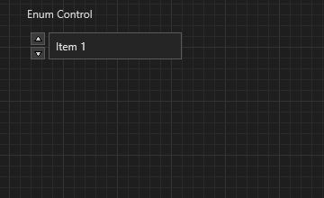
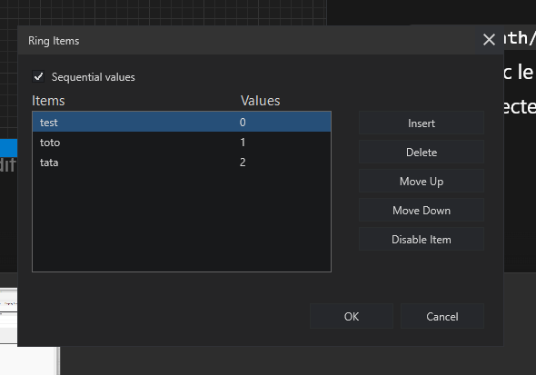

# Ring And Enum Widgets

Ring and Enum are list-style value widgets and share one Widget Navigator
family. Each has Control and Indicator variants.

## Ring

Ring presents item text backed by numeric values. The default item is `Item 1`.
Click the value area of a Ring Control to open its item list. Ring Indicator
shows the current item without accepting selection.

Use **Edit Items...** in the context menu to manage the source list. The editor
supports direct double-click editing, Insert, Delete, Move Up, Move Down,
Disable Item, and sequential or explicit values. Insert creates a row and starts
editing it immediately.

## Enum

Enum presents a finite named set and follows the same default sizing and
increment/decrement layout as Ring. Enum values use integer storage, while the
displayed item text remains user-facing.

Click the center of an Enum Control to open its popup list. Drag the surrounding
body or frame to move the widget. The popup marks the current item and updates
the control when another enabled item is chosen.

## Increment And Decrement

The increment/decrement pair can be shown or hidden and positioned on the left
or right. Its rules match Numeric: the pair is linked, compact, and optional.

## Resize And Label

Ring and Enum resize horizontally. Their value area remains interactive after
resizing, while the outside body stays available for moving. Labels use the
same magnetic default anchor as other core widgets.

## Binding

Both families bind as integer-backed values. Control variants bind toward
public inputs; indicators bind from public outputs.
